# Crawl4AI-RAG Project Alignment Plan

This document outlines the plan to align the current code implementation with the requirements specified in the Memory Bank files.

## Overview

```mermaid
graph TD
    A[Alignment Plan] --> B[Code Generation Templates]
    A --> C[Supabase Integration]
    A --> D[Error Handling]
    A --> E[Testing Infrastructure]
    
    B --> B1["Completeness: Does generic_scraper.j2 handle all required elements from productContext.md?"]
    B --> B2["Error Handling: Are generated scripts including proper try/except blocks?"]
    B --> B3["Metadata: Is scraped content provenance captured?"]
    
    C --> C1["Connection Pooling: Implemented in client.py?"]
    C --> C2["Retry Logic: Present in repository methods?"]
    C --> C3["Error Recovery: Handling Supabase disconnects?"]
    
    D --> D1["Custom Exceptions: Defined in validation.py?"]
    D --> D2["Logging: Structured logs with context?"]
    D --> D3["Graceful Degradation: Implemented in crawlers?"]
    
    E --> E1["Test Directory: Missing tests/ structure?"]
    E --> E2["VCR Setup: HTTP mocking implemented?"]
    E --> E3["Coverage: Critical paths tested?"]
```

## Detailed Action Items

### 1. Code Generation Templates
- **Key Files:** `codegen/templates/generic_scraper.j2`
- **Verification Steps:**
  1. Compare template against Use Case requirements from productContext.md
  2. Check for inclusion of error handling blocks
  3. Validate metadata tracking in generated code
- **Sample Questions:**
  - Should generated code include rate limiting by default?
  - How detailed should template comments be?

### 2. Supabase Integration  
- **Key Files:** `supabase/client.py`, `supabase/repository.py`
- **Verification Steps:**
  1. Analyze connection initialization for pooling
  2. Check query methods for retry decorators
  3. Validate error recovery in CRUD operations
- **Sample Questions:**
  - What timeout thresholds are appropriate?
  - Should we implement circuit breakers?

### 3. Error Handling
- **Key Files:** `utils/logging.py`, `utils/validation.py`
- **Verification Steps:**
  1. Check for custom exception hierarchy
  2. Validate log event structure
  3. Test partial failure handling
- **Sample Questions:**
  - Should logging use Sentry integration?
  - What's the maximum acceptable data loss?

### 4. Testing Infrastructure
- **Key Files:** (Missing tests/)
- **Verification Steps:**
  1. Create test directory structure
  2. Establish base test classes
  3. Implement VCR.py configuration
- **Sample Questions:**
  - Prioritize unit vs integration tests?
  - Mock Supabase completely or use test container?

## Recommended Implementation Order

1. Testing Infrastructure (foundational)
2. Error Handling (cross-cutting)
3. Supabase Integration (data critical)
4. Code Templates (user-facing)
