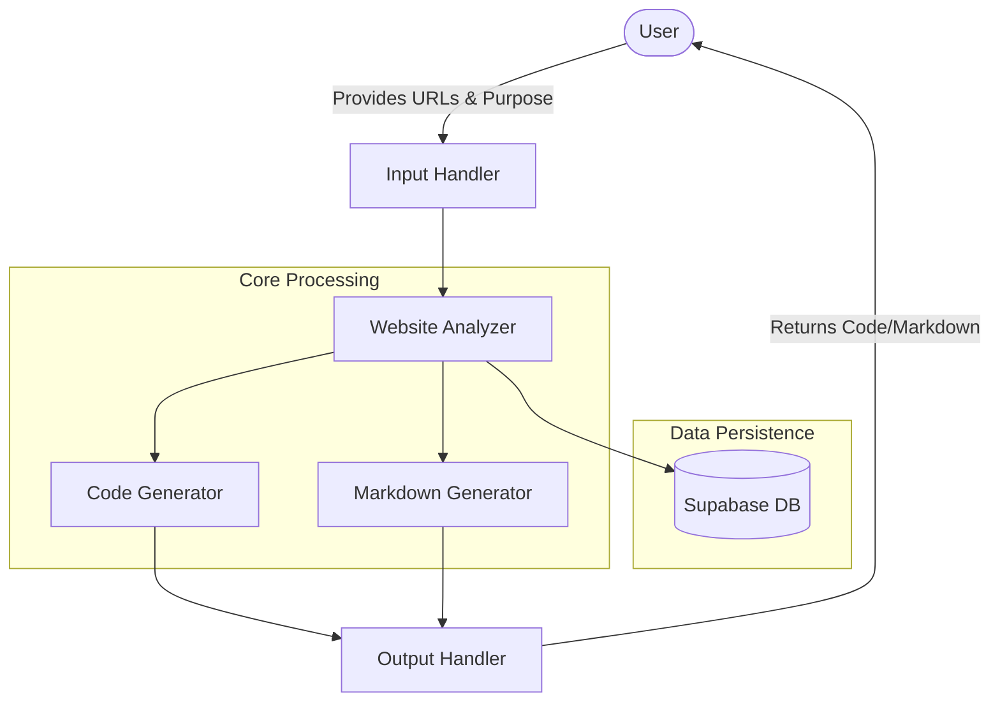
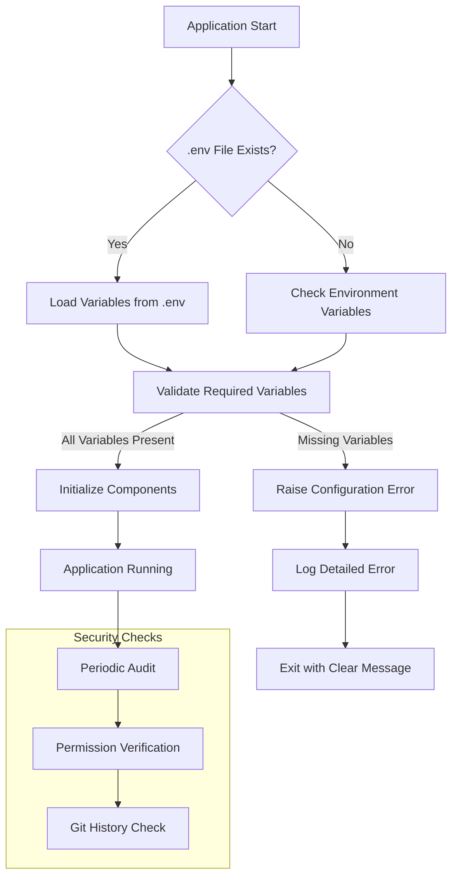

# System Patterns: crawl4ai-rag

## System Architecture

The crawl4ai-rag system follows a modular architecture organized around core capabilities:



## Key Components

### 1. Input Handler
- Processes user requests for website analysis
- Validates URLs and scraping purpose
- Configures output preferences (code, markdown, or both)

### 2. Website Analyzer
- Crawls specified websites to understand structure
- Identifies key elements based on scraping purpose
- Builds internal representation of website structure
- Interfaces with Supabase for storing and retrieving crawled pages

### 3. Code Generator
- Transforms website analysis into Python code
- Tailors code to specific scraping requirements
- Includes error handling and documentation in generated code
- Optimizes code for efficiency and readability

### 4. Markdown Generator
- Processes scraped content into structured markdown
- Organizes content based on website hierarchy
- Preserves important formatting and relationships
- Handles various content types (text, tables, lists, etc.)

### 5. Output Handler
- Manages delivery of generated code and/or markdown
- Supports direct return or file writing options
- Handles error reporting and status updates

### 6. Supabase Integration
- Stores crawled pages for efficient retrieval
- Maintains embeddings for semantic search
- Tracks crawl history and updates
- Provides persistence across sessions

## Design Patterns

### Command Pattern
Used for encapsulating scraping requests with all necessary parameters and execution logic.

```python
class ScrapingCommand:
    def __init__(self, urls, purpose, output_preferences):
        self.urls = urls
        self.purpose = purpose
        self.output_preferences = output_preferences
        
    def execute(self):
        # Orchestrate the scraping process
        pass
```

### Strategy Pattern
Applied for different scraping strategies based on website type and purpose.

```python
class ScrapingStrategy:
    def scrape(self, url, purpose):
        pass
        
class EcommerceScraper(ScrapingStrategy):
    def scrape(self, url, purpose):
        # E-commerce specific scraping logic
        pass
        
class DocumentationScraper(ScrapingStrategy):
    def scrape(self, url, purpose):
        # Documentation specific scraping logic
        pass
```

### Factory Pattern
Used for creating appropriate code generators based on scraping requirements.

```python
class CodeGeneratorFactory:
    @staticmethod
    def create_generator(website_type, scraping_purpose):
        if website_type == "ecommerce":
            return EcommerceCodeGenerator()
        elif website_type == "documentation":
            return DocumentationCodeGenerator()
        # ...
```

### Repository Pattern
Applied for database interactions with Supabase.

```python
class PageRepository:
    def __init__(self, supabase_client):
        self.client = supabase_client
        
    def save_page(self, url, content, embeddings):
        # Save page to Supabase
        pass
        
    def get_page(self, url):
        # Retrieve page from Supabase
        pass
        
    def update_page(self, url, content, embeddings):
        # Update existing page
        pass
```

## Data Flow

1. **Input Processing**:
   - User provides URLs and scraping purpose
   - System validates input and configures processing

2. **Website Analysis**:
   - System checks Supabase for existing crawl data
   - If needed, crawls website to understand structure
   - Analyzes content based on scraping purpose

3. **Generation Phase**:
   - Creates Python code for the specific scraping task
   - Optionally processes content into markdown

4. **Output Delivery**:
   - Returns generated code to user
   - Optionally writes markdown to specified location
   - Provides status and any error information

## Error Handling Strategy

- **Graceful Degradation**: System attempts to provide partial results when possible
- **Detailed Reporting**: Clear error messages with context and suggestions
- **Retry Mechanisms**: Automatic retries for transient failures
- **Validation Checks**: Input validation to prevent common errors
- **Logging**: Comprehensive logging for debugging and improvement

## Environment Variable Handling

The system uses a structured approach to environment variable management:



The environment variable loading process is handled by pydantic_settings with the following key features:
1. **Centralized Configuration**: All environment variables are defined in the `Settings` class in `config.py`
2. **Validation**: Type checking and required field validation through Pydantic
3. **Default Values**: Sensible defaults where appropriate
4. **Documentation**: Clear documentation of required variables in `.env.example`
5. **Error Handling**: Descriptive error messages when required variables are missing

## Extension Points

The system is designed with several extension points:

1. **New Website Types**: Add specialized analyzers for specific website categories
2. **Custom Code Templates**: Extend code generation with new templates
3. **Output Formats**: Add support for formats beyond code and markdown
4. **Scraping Strategies**: Implement new strategies for different scraping purposes
5. **Database Providers**: Extend beyond Supabase to other storage solutions
